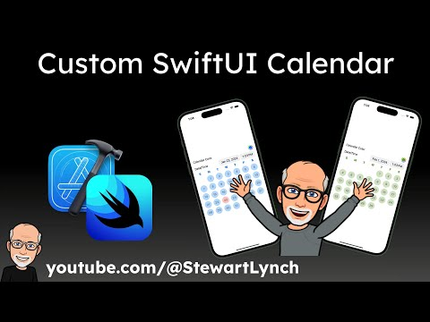

## Custom Calendar

This repository contains the source code for the completed project from the video on creating a Custom Calendar

The source code here will also be used in a subsequent video on creating and displaying tallies on the custom calendar

If you want to support my work, you can -  

